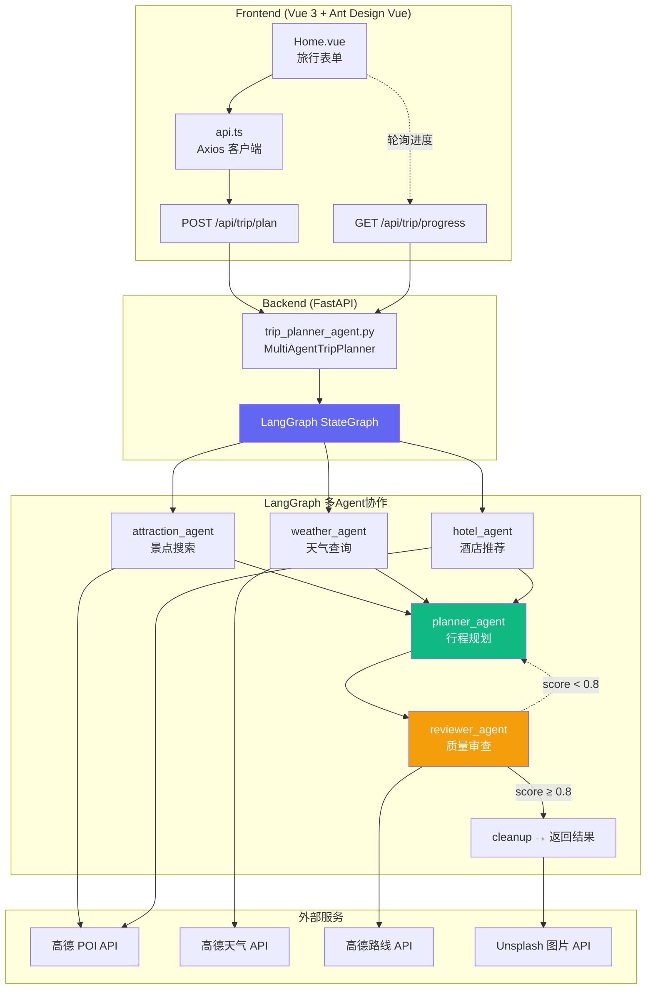
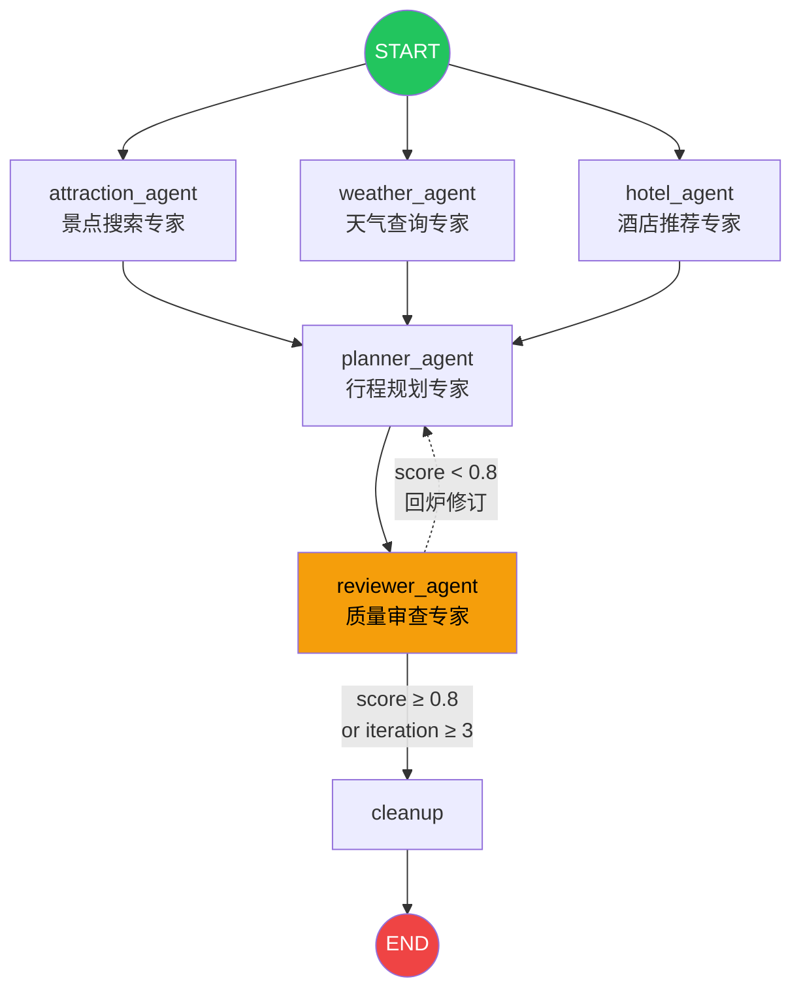
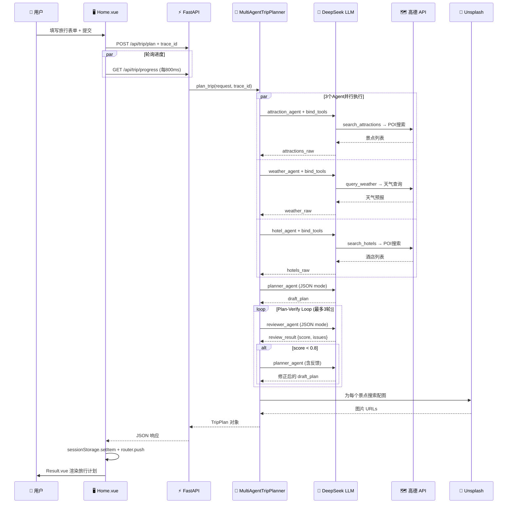

# 🌍 TripPlanAgent

> 基于 **LangGraph 图编排**的多智能体协作旅行规划系统 — 5 个专业 AI Agent 协同工作，自动搜索、规划、审查，一键生成高质量旅行方案。

<p align="center">
  
  
  
  
  
  
</p>

---

## 📖 项目简介

**TripPlanAgent** 解决的是传统旅行规划工具的三大痛点：

| 痛点 | 传统方式 | TripPlanAgent |
|------|---------|---------------|
| 信息分散 | 手动查攻略、看天气、比酒店 — 切换 N 个 App | 3 个研究 Agent **并行**搜索，一次搞定 |
| 规划质量参差 | 模板化路线，不考虑时间/距离/偏好 | **Plan-Verify Loop** 自我审查，不达标自动修订 |
| 缺乏协作 | 单人单次生成，没有专业分工 | 5 个专业 Agent 各司其职，像团队一样协作 |

### 为什么开发它？

市面上的旅行规划工具大多是基于模板填充或单次 LLM 调用，容易出现"景点距离不合理"、"时间安排不可行"等问题。TripPlanAgent 引入了 **多 Agent 协作 + 质量审查循环**，让 AI 自己检查并修正自己的计划。

### 与同类项目的区别

- **LangGraph 图编排**：不是简单的 prompt chain，而是用有向状态图管理 Agent 协作流
- **标准 Function Calling**：工具调用使用 OpenAI 原生协议，而非自定义文本解析
- **Plan-Verify Loop**：引入 Reviewer Agent 从 5 个维度量化评分，不合格自动回炉（最多 3 轮）
- **真实验证**：调用高德地图 API 实测路线距离，而非凭空估算

### 核心亮点

- 🧠 **多 Agent 协作**：景点搜索、天气查询、酒店推荐 3 个 Agent 并行执行
- 🔄 **自我纠错**：Reviewer 从地理、时间、预算、多样性、偏好 5 维度打分
- 🗺️ **真实地图数据**：基于高德 REST API 的 POI 搜索、路线规划、天气查询
- 📸 **自动配图**：通过 Unsplash API 为每个景点搜索真实照片
- 📊 **实时进度**：前端轮询展示 5 步进度条，规划过程透明可见
- 🐳 **一键部署**：`docker compose up` 即可启动全栈

---

## ✨ 功能特性

### 🧠 多智能体协作

- **5 个专业 Agent**：景点搜索专家、天气查询专家、酒店推荐专家、行程规划专家、质量审查专家
- **Fan-out/Fan-in 并行**：3 个研究 Agent 同时启动，互不阻塞
- **共享状态黑板**：所有 Agent 读写同一个 `TripPlanState`，自动合并无冲突
- **条件路由**：根据 Reviewer 评分自动决定通过还是回炉

### 🔍 信息搜索

- **POI 搜索**：基于高德地图 API，支持按关键词和城市搜索景点/酒店
- **天气预报**：查询目的地多日天气，含白天/夜间温度、风力风向
- **路线规划**：支持步行/驾车/公交三种出行方式的真实距离估算
- **景点配图**：Unsplash 图片搜索，为每个景点匹配真实照片

### 📋 行程规划

- **结构化输出**：每天 2-3 个景点 + 早中晚三餐 + 酒店推荐
- **经纬度坐标**：每个景点都附带真实经纬度，可在 Google Maps/高德打开
- **预算明细**：门票、酒店、餐饮、交通分项加总，一目了然
- **偏好匹配**：支持历史文化、自然风光、美食、购物、艺术、休闲 6 种标签

### 🛡️ 质量保证

- **5 维度审查**：地理合理性(30%)、时间可行性(25%)、预算准确性(15%)、多样性(15%)、偏好匹配(15%)
- **自动修订**：评分 < 0.8 自动回 Planner 修正，最多 3 轮
- **评估框架**：内置自动化测试，4 个城市用例 + 5 维度自动评分

### 🖥️ 用户体验

- **响应式 UI**：Vue 3 + Ant Design Vue 4，适配桌面和移动端
- **实时进度条**：搜索 → 规划 → 审查 → 配图 → 完成，5 步可视化
- **折叠面板**：按天展开/收起行程，信息层级清晰

---

## 🛠 技术栈

| Category | Technology | Version |
|----------|-----------|---------|
| **Agent 编排** | LangGraph (StateGraph + Conditional Edges) | ≥0.2.0 |
| **LLM 调用** | langchain-openai (ChatOpenAI, 兼容 DeepSeek API) | ≥0.2.0 |
| **工具系统** | langchain_core.tools (@tool 装饰器, Function Calling) | - |
| **后端框架** | FastAPI + Uvicorn | ≥0.115.0 |
| **数据校验** | Pydantic v2 + pydantic-settings | ≥2.0.0 |
| **地图服务** | 高德 REST API (POI/天气/路线/地理编码) | v3 |
| **图片服务** | Unsplash API | v1 |
| **日志** | loguru (结构化日志 + 文件轮转) | ≥0.7.0 |
| **前端框架** | Vue 3 + TypeScript | ^3.5.13 |
| **UI 组件** | Ant Design Vue 4 | ^4.2.6 |
| **路由** | Vue Router 4 | ^4.5.0 |
| **HTTP 客户端** | Axios (前端) / httpx (后端) | ^1.7.9 / ≥0.27.0 |
| **构建工具** | Vite 6 | ^6.0.7 |
| **容器化** | Docker + Docker Compose | - |

---

## 🏗 项目架构

### 系统架构图



### LangGraph 图拓扑



### 数据流



---

## 📁 目录结构

```text
TripPlanAgent/
├── docker-compose.yml                    # 🐳 一键启动前后端
├── README.md                             # 📖 项目文档
├── .gitignore                            # Git 忽略规则
├── .dockerignore                         # Docker 构建忽略
├── backend/                              # 🐍 Python 后端
│   ├── Dockerfile                        # Python 3.11-slim 镜像
│   ├── requirements.txt                  # Python 依赖清单
│   ├── .env.example                      # 环境变量模板
│   ├── run.py                            # Uvicorn 启动入口
│   ├── app/
│   │   ├── __init__.py                   # 版本声明（v1.0.0）
│   │   ├── config.py                     # 配置管理 + loguru 日志配置
│   │   ├── agents/                       # 🧠 Agent 层
│   │   │   ├── trip_planner_agent.py     # ★ LangGraph 图定义 + 5个Agent节点
│   │   │   └── tools.py                  # @tool 工具定义（4个工具）
│   │   ├── services/                     # 🔌 外部服务层
│   │   │   ├── llm_service.py            # ChatOpenAI 封装（兼容 DeepSeek）
│   │   │   ├── amap_service.py           # 高德 REST API 封装
│   │   │   └── unsplash_service.py       # Unsplash 图片搜索
│   │   ├── models/                       # 📦 数据模型
│   │   │   └── schemas.py                # Pydantic 请求/响应模型
│   │   └── api/                          # 🌐 API 层
│   │       ├── main.py                   # FastAPI 应用入口 + CORS
│   │       └── routes/                   # 路由模块
│   │           ├── trip.py               # /api/trip/* 旅行规划核心接口
│   │           ├── poi.py                # /api/poi/* POI搜索+配图
│   │           └── map.py                # /api/map/* 地图+天气+路线
│   └── tests/                            # 🧪 测试
│       └── eval/                         # 评估框架
│           ├── test_cases.py             # 4个评估用例（北京/杭州/成都/上海）
│           └── eval_runner.py            # 5维度自动评分 + 汇总报告
├── frontend/                             # 🖥️ Vue 前端
│   ├── Dockerfile                        # Node 20-slim 镜像
│   ├── package.json                      # 前端依赖 + 脚本
│   ├── tsconfig.json                     # TypeScript 配置
│   ├── vite.config.ts                    # Vite 配置（含 API 代理）
│   ├── index.html                        # 入口 HTML
│   └── src/
│       ├── main.ts                       # Vue 应用入口 + 路由定义
│       ├── App.vue                       # 根组件（Header+Content+Footer 布局）
│       ├── views/                        # 页面组件
│       │   ├── Home.vue                  # 旅行表单页（含进度轮询）
│       │   └── Result.vue                # 结果展示页（行程/预算/天气）
│       ├── services/
│       │   └── api.ts                    # Axios API 客户端
│       └── types/
│           └── index.ts                  # TypeScript 类型定义
└── logs/                                 # 📝 日志文件（自动轮转保留7天）
```

> **核心代码量**：`trip_planner_agent.py`（~730 行）包含完整的 LangGraph 编排逻辑、5 个 Agent 节点、Plan-Verify Loop 和进度追踪。

---

## 🚀 快速开始

### 环境要求

| 依赖 | 最低版本 | 说明 |
|------|---------|------|
| **Python** | 3.11+ | 后端运行环境 |
| **Node.js** | 20+ | 前端运行环境 |
| **Docker** | 24.0+ | 容器化部署（可选） |
| **DeepSeek API Key** | - | LLM 调用（兼容 OpenAI 格式的也可） |
| **高德地图 API Key** | - | POI 搜索、天气、路线规划 |

### 安装

#### 方式一：Docker（推荐，一键启动）

```bash
# 1. 克隆项目
git clone https://github.com/your-username/TripPlanAgent.git
cd TripPlanAgent

# 2. 配置 API 密钥
cp backend/.env.example backend/.env
# 编辑 backend/.env，填入你的 API 密钥（见下方配置说明）

# 3. 一键启动
docker compose up

# 4. 打开浏览器
# 前端: http://localhost:5173
# API 文档: http://localhost:8000/docs
# 健康检查: http://localhost:8000/health
```

#### 方式二：手动启动

```bash
# 1. 克隆项目
git clone https://github.com/your-username/TripPlanAgent.git
cd TripPlanAgent

# 2. 安装后端依赖
cd backend
pip install -r requirements.txt

# 3. 安装前端依赖
cd ../frontend
npm install

# 4. 配置环境变量
cp ../backend/.env.example ../backend/.env
# 编辑 ../backend/.env，填入 API 密钥
```

### 配置环境变量

复制 `backend/.env.example` 为 `backend/.env`，编辑其中的配置：

```env
# ===== LLM 配置（必需）=====
LLM_MODEL_ID=deepseek-v4-pro          # 模型 ID
LLM_API_KEY=your_llm_api_key_here     # API 密钥（也支持 OPENAI_API_KEY）
LLM_BASE_URL=https://api.deepseek.com # API 地址（兼容 OpenAI 格式的都可以）

# ===== 高德地图配置（必需）=====
AMAP_API_KEY=your_amap_api_key_here   # 高德开放平台申请的 Web 服务 Key

# ===== 服务器配置 =====
HOST=0.0.0.0
PORT=8000

# ===== CORS 配置 =====
CORS_ORIGINS=http://localhost:5173,http://localhost:3000

# ===== 日志配置 =====
LOG_LEVEL=INFO

# ===== Unsplash 图片服务（可选）=====
UNSPLASH_ACCESS_KEY=""                # 不配置则景点无配图
UNSPLASH_SECRET_KEY=""
```

**获取 API 密钥：**

| 密钥 | 申请地址 | 费用 |
|------|---------|------|
| `LLM_API_KEY` | [DeepSeek 开放平台](https://platform.deepseek.com) | 按量付费 |
| `AMAP_API_KEY` | [高德开放平台](https://lbs.amap.com) → 创建应用 → 添加"Web服务" | 每日免费额度 |
| `UNSPLASH_ACCESS_KEY` | [Unsplash Developers](https://unsplash.com/developers) | 免费（有限额） |

### 启动项目

**开发环境：**

```bash
# 终端 1：启动后端（带热重载）
cd backend
python run.py          # → http://localhost:8000

# 终端 2：启动前端（带 HMR）
cd frontend
npm run dev            # → http://localhost:5173
```

**生产环境：**

```bash
# 构建前端
cd frontend
npm run build          # 输出到 dist/

# 使用 Docker 部署
docker compose up -d
```

---

## 📡 API 文档

启动后端后，访问 Swagger UI 查看完整 API 文档：

- **Swagger UI**：http://localhost:8000/docs
- **ReDoc**：http://localhost:8000/redoc

### 核心接口

#### `POST /api/trip/plan` — 生成旅行计划

**Request：**

```http
POST /api/trip/plan?trace_id=abc12345
Content-Type: application/json
```

```json
{
  "city": "北京",
  "start_date": "2025-06-01",
  "end_date": "2025-06-03",
  "travel_days": 3,
  "transportation": "公共交通",
  "accommodation": "经济型酒店",
  "preferences": ["历史文化", "美食"],
  "free_text_input": "希望多安排一些博物馆"
}
```

**Response：**

```json
{
  "success": true,
  "message": "旅行计划生成成功",
  "trace_id": "abc12345",
  "data": {
    "city": "北京",
    "start_date": "2025-06-01",
    "end_date": "2025-06-03",
    "days": [
      {
        "date": "2025-06-01",
        "day_index": 0,
        "description": "探索历史文化的深度之旅",
        "transportation": "公共交通",
        "accommodation": "经济型酒店",
        "hotel": {
          "name": "如家快捷酒店(北京天安门店)",
          "address": "北京市东城区...",
          "location": { "longitude": 116.397, "latitude": 39.916 },
          "price_range": "200-400元",
          "rating": "4.3",
          "distance": "距故宫1.2公里",
          "type": "经济型酒店",
          "estimated_cost": 300
        },
        "attractions": [
          {
            "name": "故宫博物院",
            "address": "北京市东城区景山前街4号",
            "location": { "longitude": 116.397, "latitude": 39.916 },
            "visit_duration": 180,
            "description": "明清两代的皇家宫殿",
            "category": "历史文化",
            "ticket_price": 60,
            "image_url": "https://images.unsplash.com/..."
          }
        ],
        "meals": [
          { "type": "breakfast", "name": "护国寺小吃", "description": "老北京早点", "estimated_cost": 30 },
          { "type": "lunch", "name": "四季民福烤鸭店", "description": "故宫附近", "estimated_cost": 80 },
          { "type": "dinner", "name": "簋街麻小", "description": "麻辣小龙虾", "estimated_cost": 100 }
        ]
      }
    ],
    "weather_info": [
      {
        "date": "2025-06-01",
        "day_weather": "晴",
        "night_weather": "多云",
        "day_temp": 28,
        "night_temp": 18,
        "wind_direction": "南风",
        "wind_power": "1-3级"
      }
    ],
    "overall_suggestions": "北京6月初气候宜人，适合户外游览...",
    "budget": {
      "total_attractions": 180,
      "total_hotels": 900,
      "total_meals": 630,
      "total_transportation": 150,
      "total": 1860
    }
  }
}
```

#### `GET /api/trip/progress` — 查询规划进度

```http
GET /api/trip/progress?trace_id=abc12345
```

**Response：**

```json
{
  "trace_id": "abc12345",
  "step": "searching",
  "message": "正在搜索北京的景点..."
}
```

`step` 可能的值：

| Step | 含义 |
|------|------|
| `idle` | 等待中 |
| `searching` | 正在搜索景点/天气/酒店 |
| `planning` | 正在生成旅行计划 |
| `reviewing` | 正在审查计划质量 |
| `revising` | 评分不达标，修订中 |
| `enriching` | 正在为景点配图 |
| `done` | 规划完成 |

#### 其他接口

| Method | Path | 说明 |
|--------|------|------|
| `GET` | `/` | 服务信息 |
| `GET` | `/health` | 全局健康检查 |
| `GET` | `/api/trip/health` | Agent 健康检查 |
| `GET` | `/api/poi/search?keywords=故宫&city=北京` | POI 搜索 |
| `GET` | `/api/poi/detail/{poi_id}` | POI 详情 |
| `GET` | `/api/poi/photo?name=故宫` | 景点配图 |
| `GET` | `/api/map/poi?keywords=酒店&city=北京` | 地图 POI 搜索 |
| `GET` | `/api/map/weather?city=北京` | 天气查询 |
| `POST` | `/api/map/route` | 路线规划 |

---

## 🧪 测试

### 评估框架

项目内置了 Agent 评估框架，自动测试旅行计划的质量：

```bash
cd backend
python tests/eval/eval_runner.py
```

**评估维度：**

| 维度 | 权重 | 检查内容 |
|------|------|---------|
| 结构完整性 | 20% | 必填字段是否齐全（城市、日期、景点、三餐） |
| 景点覆盖率 | 25% | 每天至少 2 个景点，是否达标 |
| 偏好匹配度 | 25% | 景点名称/描述/类别是否匹配用户偏好 |
| 地理合理性 | 15% | 经纬度是否在目标城市范围内 |
| 预算合理性 | 15% | 各项费用加总是否正确，总额是否合理 |

**测试用例：**

| 用例 | 城市 | 天数 | 偏好 |
|------|------|------|------|
| 北京2日历史文化 | 北京 | 2天 | 历史文化 |
| 杭州2日自然风光 | 杭州 | 2天 | 自然风光 |
| 成都3日美食之旅 | 成都 | 3天 | 美食、休闲 |
| 上海1日购物 | 上海 | 1天 | 购物、艺术 |

**输出示例：**

```
╔══════════════════════════════════════════════════════════════╗
║           TripPlanAgent — Agent 评估报告                    ║
╚══════════════════════════════════════════════════════════════╝

用例                   结构   覆盖   偏好   地理   预算   总分
--------------------------------------------------------
北京2日历史文化         95%   80%   100%   85%   80%    89%
杭州2日自然风光         90%   75%    95%   80%   75%    84%
...
```

---

## 🐳 Docker 部署

### 构建镜像

```bash
# 后端镜像
docker build -t tripplan-backend ./backend

# 前端镜像
docker build -t tripplan-frontend ./frontend
```

### 使用 Docker Compose

```yaml
# docker-compose.yml
services:
  backend:
    build: ./backend
    container_name: tripplan-backend
    ports:
      - "8000:8000"
    env_file:
      - backend/.env
    volumes:
      - ./backend/logs:/app/logs      # 日志持久化
    restart: unless-stopped

  frontend:
    build: ./frontend
    container_name: tripplan-frontend
    ports:
      - "5173:5173"
    depends_on:
      - backend
    restart: unless-stopped
```

```bash
# 启动
docker compose up -d

# 查看日志
docker compose logs -f

# 停止
docker compose down
```

---

## 🔧 配置说明

### 环境变量完整列表

| 变量 | 必填 | 默认值 | 说明 |
|------|------|--------|------|
| `LLM_MODEL_ID` | ✅ | `deepseek-v4-pro` | LLM 模型 ID |
| `LLM_API_KEY` | ✅ | - | LLM API 密钥（也支持 `OPENAI_API_KEY`） |
| `LLM_BASE_URL` | ✅ | `https://api.deepseek.com` | LLM API 地址 |
| `AMAP_API_KEY` | ✅ | - | 高德地图 Web 服务 Key |
| `HOST` | ❌ | `0.0.0.0` | 服务监听地址 |
| `PORT` | ❌ | `8000` | 服务端口 |
| `CORS_ORIGINS` | ❌ | `http://localhost:5173,...` | 允许的跨域来源（逗号分隔） |
| `LOG_LEVEL` | ❌ | `INFO` | 日志级别（DEBUG/INFO/WARNING/ERROR） |
| `UNSPLASH_ACCESS_KEY` | ❌ | - | Unsplash API Key（不配置则景点无配图） |
| `UNSPLASH_SECRET_KEY` | ❌ | - | Unsplash Secret Key |

### 日志管理

项目使用 **loguru** 进行结构化日志管理：

- **控制台输出**：彩色格式，适合开发调试
- **文件输出**：`logs/trip_agent_YYYY-MM-DD.log`，自动轮转（10MB/文件），保留 7 天
- **格式**：`时间 | 级别 | trace_id | 消息`

---

## 🔒 安全设计

### API 密钥管理

- 所有密钥通过 `.env` 文件注入，**绝不硬编码**
- `.env` 已加入 `.gitignore`，不会被提交到版本库
- 提供 `.env.example` 模板，不含真实密钥

### CORS 保护

- 白名单模式：仅允许 `CORS_ORIGINS` 中配置的前端地址跨域访问
- 默认仅允许 `localhost:5173` 和 `localhost:3000`

### 输入校验

- 所有 API 输入使用 Pydantic v2 严格校验
- `travel_days` 限制 1-30 天，防止资源滥用
- LLM 输出经过 JSON 解析 + Pydantic 模型验证后才返回

### 最佳实践

- 生产环境建议在前端加 **Nginx 反向代理**，统一入口
- 建议为 API 添加 **Rate Limiting**（可用 `slowapi` 等中间件）
- 如需公网暴露，建议加 **API Key 鉴权** 或 JWT 验证

---

## 🚄 性能优化

### 后端优化

- **并行搜索**：3 个研究 Agent 通过 LangGraph Fan-out 同时执行，而非串行等待
- **连接复用**：httpx 使用 `Client` 单例，复用 TCP 连接池
- **LLM 单例**：ChatOpenAI 实例全局复用，避免重复初始化
- **地理编码缓存**：城市 adcode 缓存在内存中，避免重复调用
- **配图并发**：ThreadPoolExecutor（最多 5 线程）并行获取景点图片
- **内存清理**：`cleanup_node` 清空原始数据 + `gc.collect()` 释放大对象

### 前端优化

- **增量进度**：轮询 `/api/trip/progress` 而非阻塞等待，用户体验更流畅
- **按需渲染**：`a-collapse` 折叠面板，用户按天展开，减少 DOM 节点
- **Vite 构建**：ESBuild 极速打包 + Tree Shaking 减少体积
- **组件级懒加载**：Vue Router 天然支持路由级代码分割

---

## 📋 Roadmap

- [ ] **流式输出 (SSE)**：规划结果逐 token 流式返回，首字延迟降至 2s 以内
- [ ] **多语言支持**：英文界面 + 海外城市规划（Google Maps API）
- [ ] **用户系统**：保存历史旅行计划，支持编辑和分享
- [ ] **协作规划**：多人共同编辑一份旅行计划
- [ ] **预算优化**：根据用户预算自动选择性价比最优方案
- [ ] **POI 评分**：整合大众点评/Google Reviews 真实评分
- [ ] **离线地图**：生成 PDF 版旅行手册，含地图截图
- [ ] **移动端适配**：PWA 支持，可离线查看已生成的计划
- [ ] **MCP 集成**：支持 MCP 协议动态加载第三方工具
- [ ] **监控面板**：LangSmith / LangFuse 集成，追踪 Agent 调用链

---

## ❓ 常见问题

### Q1：支持哪些 LLM 提供商？

任何兼容 OpenAI Chat Completions API 的都可以。默认使用 DeepSeek，你也可以改用：

- **OpenAI**：设 `LLM_BASE_URL=https://api.openai.com/v1`，`LLM_MODEL_ID=gpt-4o`
- **其他国产模型**：如 Moonshot、MiniMax、Qwen 等，只要兼容 OpenAI 格式即可

### Q2：高德 API Key 如何获取？

1. 访问 [高德开放平台](https://lbs.amap.com)
2. 注册账号 → 控制台 → 创建应用
3. 添加 Key，服务平台选择"**Web服务**"
4. 将 Key 填入 `AMAP_API_KEY`

### Q3：Unsplash 配图是必需的吗？

不是。如果不配置 `UNSPLASH_ACCESS_KEY`，生成的旅行计划中景点不会有配图，其他功能不受影响。

### Q4：规划一次需要多长时间？

取决于天数、LLM 响应速度和 API 调用次数。通常情况下：

- 3 个研究 Agent **并行**执行：~5-10 秒
- Planner + Reviewer（1 轮）：~10-15 秒
- Plan-Verify Loop（如果触发修订）：每轮额外 ~10 秒
- 景点配图（并发 5 线程）：~2-5 秒
- **总计**：通常 20-40 秒

### Q5：为什么 Reviewer 评分总是很低？

可能的原因：

- LLM 对目标城市不熟悉，编造了不存在的景点
- 高德 API 返回的 POI 数据不足
- 偏好关键词匹配要求过高

建议：检查日志中的 `review_result`，查看具体扣分维度；调整 `.env` 中的 `LLM_MODEL_ID` 到更强模型。

### Q6：支持哪些城市？

支持高德地图 POI 搜索覆盖的所有中国城市（理论上 300+ 个地级市）。

---

## 🤝 贡献指南

我们欢迎任何形式的贡献！

### 贡献流程

1. **Fork** 本项目
2. 创建特性分支：`git checkout -b feature/amazing-feature`
3. 提交更改：`git commit -m 'feat: add amazing feature'`
4. 推送到分支：`git push origin feature/amazing-feature`
5. 创建 **Pull Request**

### Commit 规范

本项目使用 [Conventional Commits](https://www.conventionalcommits.org/)：

- `feat:` 新功能
- `fix:` 修复 Bug
- `refactor:` 重构
- `docs:` 文档更新
- `chore:` 构建/工具链变更
- `test:` 测试相关

### 开发指南

```bash
# 后端开发
cd backend
pip install -r requirements.txt
python run.py          # 修改代码后自动重载

# 前端开发
cd frontend
npm install
npm run dev            # 修改代码后 HMR 热更新

# 运行评估
cd backend
python tests/eval/eval_runner.py
```

---

## 📄 License

本项目基于 **MIT License** 开源。

---

## 👤 作者

**TripPlanAgent** 由 [cadqwq](https://github.com/cadqwq) 开发和维护。

如果你觉得这个项目有用，请给一个 ⭐ Star！

---

## 🙏 致谢

TripPlanAgent 站在以下开源项目的肩膀上：

| 项目 | 用途 |
|------|------|
| [LangGraph](https://github.com/langchain-ai/langgraph) | Agent 图编排框架 |
| [LangChain](https://github.com/langchain-ai/langchain) | LLM 应用框架 |
| [FastAPI](https://github.com/tiangolo/fastapi) | 高性能 Python Web 框架 |
| [Pydantic](https://github.com/pydantic/pydantic) | 数据校验 |
| [Vue.js](https://github.com/vuejs/core) | 渐进式前端框架 |
| [Ant Design Vue](https://github.com/vueComponent/ant-design-vue) | 企业级 UI 组件库 |
| [Vite](https://github.com/vitejs/vite) | 下一代前端构建工具 |
| [loguru](https://github.com/Delgan/loguru) | 优雅的 Python 日志库 |
| [高德开放平台](https://lbs.amap.com) | 地图数据服务 |
| [Unsplash](https://unsplash.com/developers) | 免费图片 API |

---

<p align="center">
  <b>⭐ 如果这个项目对你有帮助，请给一个 Star！</b><br>
  <sub>Made with ❤️ by cadqwq</sub>
</p>
